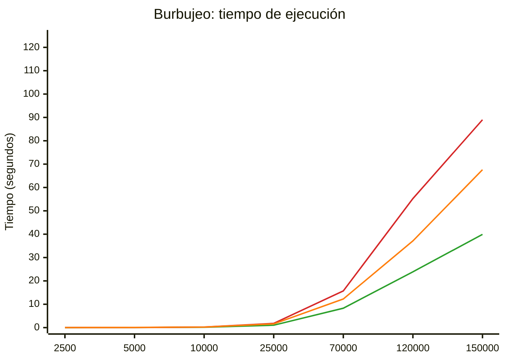
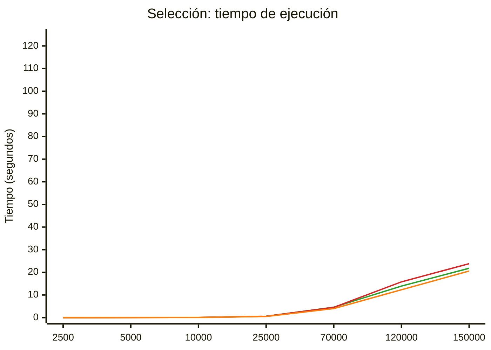
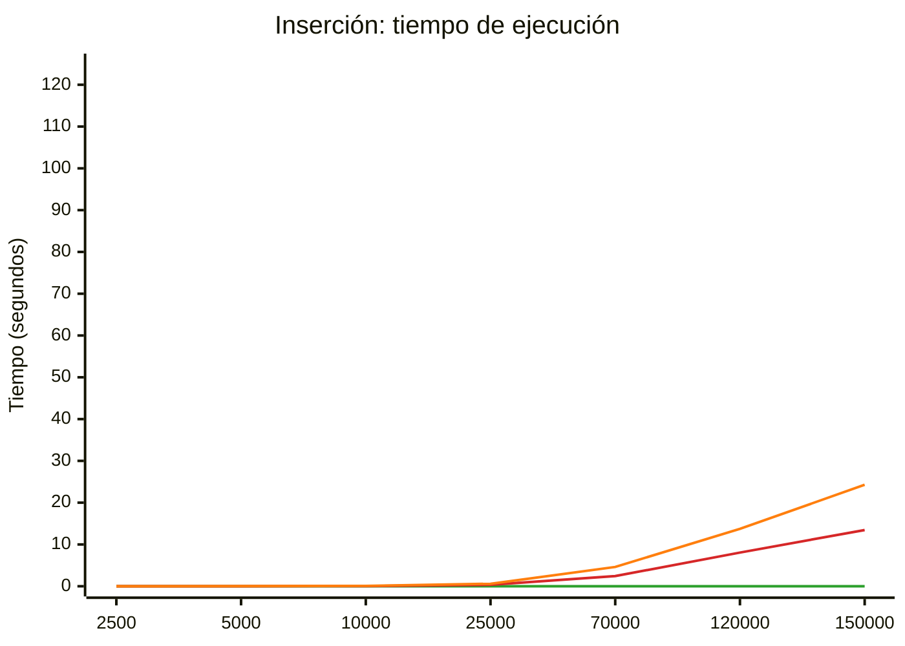
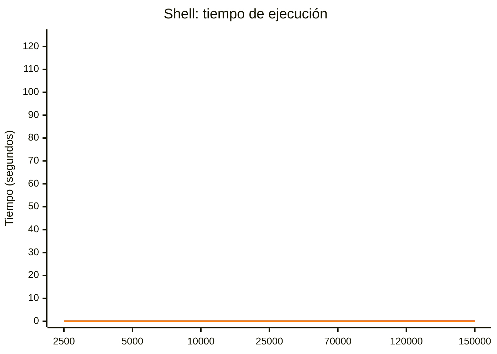
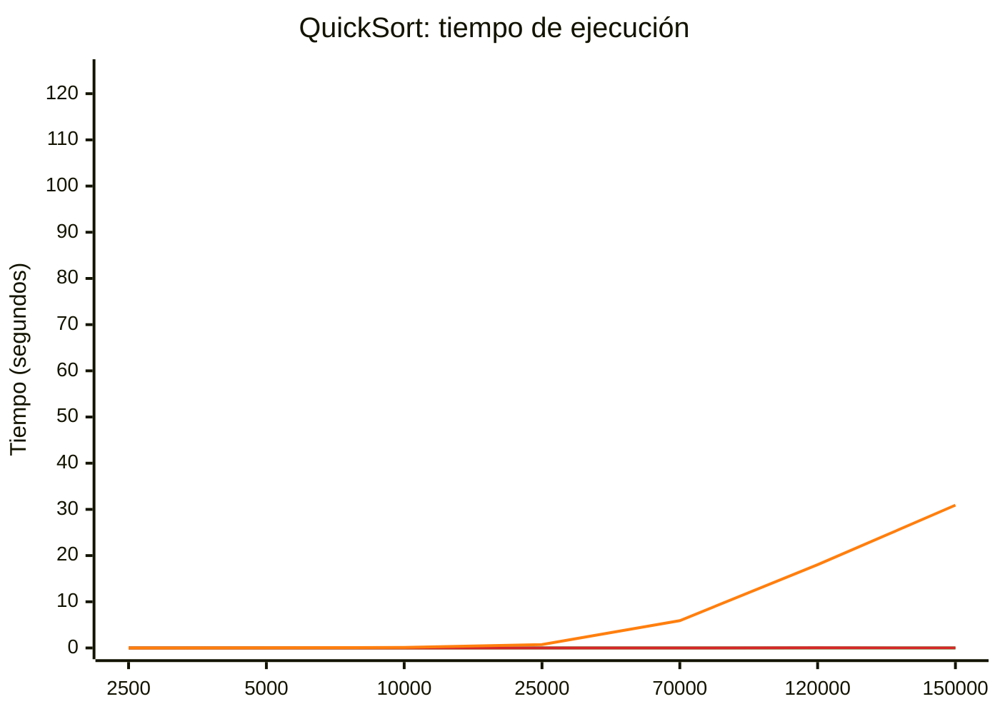
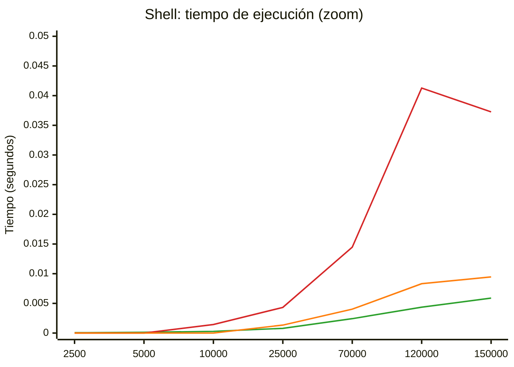
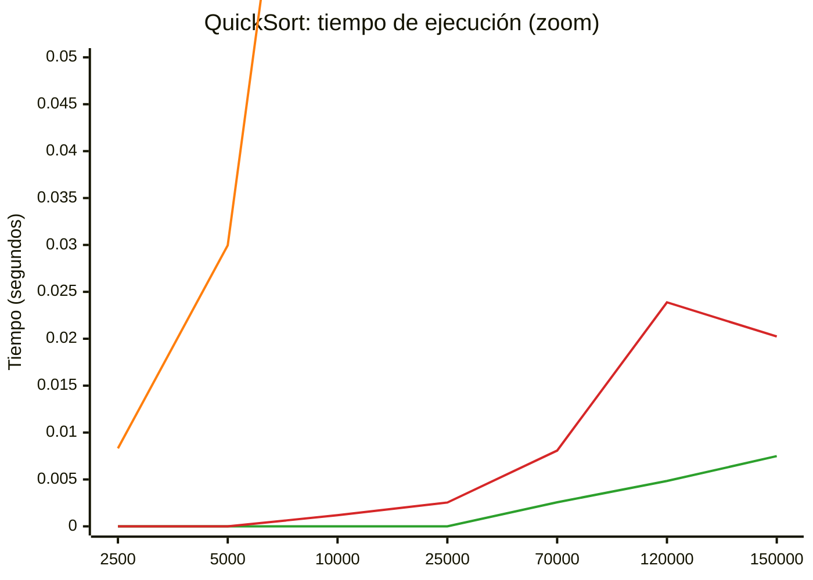

# Análisis de algoritmos de ordenamiento

_Helena Cusworth_

## 1. Casos analizados

| Algoritmo                               | Mejor caso                                                                       | Caso medio | Peor caso                                                                  |
| --------------------------------------- | -------------------------------------------------------------------------------- | ---------- | -------------------------------------------------------------------------- |
| Selección                               | Cualquier arreglo (el tiempo prácticamente no cambia)                            | Aleatorio  | Cualquier arreglo (el tiempo prácticamente no cambia)                      |
| Burbujeo (sin optimizar)                | Cualquier arreglo (el tiempo prácticamente no cambia)                            | Aleatorio  | Cualquier arreglo (el tiempo prácticamente no cambia)                      |
| Inserción                               | Arreglo ordenado ascendentemente                                                 | Aleatorio  | Arreglo ordenado descendentemente                                          |
| Shell                                   | Arreglo ordenado ascendentemente                                                 | Aleatorio  | No existe una construcción sencilla conocida. Se utiliza una aproximación. |
| QuickSort (último elemento como pivote) | Arreglo construido para que el último elemento de cada subarreglo sea su mediana | Aleatorio  | Arreglo ordenado ascendente o descendente                                  |

## 2. Funcionamiento de cada algoritmo

### Burbujeo

Este método funciona mediante revisiones sucesivas del arreglo, comparando pares de elementos adyacentes e intercambiándolos si están en el orden incorrecto. En cada pasada completa, el elemento más grande de la porción desordenada flota hacia su posición final al extremo derecho, como una burbuja. Su cantidad de operaciones máximas se modela de forma cuadrática estricta, lo que genera un volumen muy alto de intercambios físicos en memoria cuando los datos no están ordenados.

### Selección

Su funcionamiento consiste en buscar cíclicamente el elemento mínimo de la sección desordenada del vector para colocarlo en su posición definitiva, intercambiándolo con el elemento actual del bucle externo. La principal característica de este método es su rigidez operativa, ya que realiza exactamente el mismo número de comparaciones sin importar cómo vengan distribuidos los datos inicialmente, lo que impide que aproveche vectores parcial o totalmente ordenados para mejorar su tiempo de ejecución.

### Inserción

Este algoritmo va construyendo el arreglo ordenado elemento por elemento, tomando el valor actual de la iteración y desplazándolo hacia la izquierda a través de comparaciones directas hasta encontrar su lugar correcto entre los datos que ya fueron procesados previamente. Su rendimiento es altamente sensible al estado inicial del vector, siendo extremadamente eficiente en arreglos casi ordenados, pero degradándose al máximo cuando los datos se presentan en orden inverso debido a la necesidad de desplazar continuamente los elementos.

### Shell

Se trata de una extensión y optimización del método de inserción que rompe la limitación de realizar únicamente intercambios adyacentes. Funciona comparando elementos separados por una distancia o brecha predeterminada que se va reduciendo en cada fase del algoritmo. Al permitir que los valores den saltos grandes al inicio del proceso, elimina de forma masiva el desorden estructural del arreglo mucho antes de llegar a la fase final de paso simple, optimizando drásticamente los tiempos globales de ejecución.

### QuickSort

Es un algoritmo basado en la técnica de dividir y conquistar. Su funcionamiento se apoya en la elección de un elemento llamado pivote, el cual se utiliza para reordenar el arreglo de modo que todos los elementos menores al pivote queden a su izquierda y todos los mayores a su derecha, repitiendo luego el proceso de forma recursiva en los subarreglos resultantes. Su eficiencia depende críticamente de la estrategia de selección del pivote, ya que si la partición divide el trabajo de manera desigual, su estructura óptima colapsa y reduce su panorama de análisis a un solo elemento por nivel.

### Verificación de corrección

Antes de medir los tiempos, se verificó que los cinco algoritmos ordenen correctamente mediante la suite de tests del proyecto (`make test`), que compara la salida de cada uno contra un arreglo de referencia ya ordenado.

## 3. Tiempos de ejecución medidos

### Burbujeo

| Tamaño (n) | Mejor caso | Peor caso | Caso medio |
| ---------: | ---------: | --------: | ---------: |
|      2.500 |   0,012250 |  0,016082 |   0,017127 |
|      5.000 |   0,041634 |  0,054544 |   0,063024 |
|     10.000 |   0,167194 |  0,238333 |   0,246449 |
|     25.000 |   1,022270 |  1,804034 |   1,586128 |
|     70.000 |   8,302868 | 15,705704 |  12,254108 |
|    120.000 |  23,897652 | 55,250787 |  37,131752 |
|    150.000 |  39,922978 | 88,994592 |  67,606014 |

Aunque el caso medio y el peor caso de Burbujeo poseen la misma complejidad temporal asintótica (O(n^2)), los tiempos de ejecución reales pueden variar debido a factores propios de la arquitectura del procesador, como la predicción de saltos (branch prediction), el comportamiento de la memoria caché y otras optimizaciones de hardware. Por este motivo, es posible que un arreglo aleatorio tarde ligeramente más en ordenarse que uno invertido, sin que ello contradiga el análisis teórico del algoritmo.

### Selección

| Tamaño (n) | Mejor caso | Peor caso | Caso medio |
| ---------: | ---------: | --------: | ---------: |
|      2.500 |   0,005750 |  0,006066 |   0,005845 |
|      5.000 |   0,022954 |  0,024888 |   0,020978 |
|     10.000 |   0,091101 |  0,094866 |   0,082286 |
|     25.000 |   0,578946 |  0,593920 |   0,515113 |
|     70.000 |   4,622327 |  4,524312 |   4,004627 |
|    120.000 |  13,937875 | 15,804181 |  12,309913 |
|    150.000 |  21,796993 | 23,829920 |  20,578221 |

### Inserción

| Tamaño (n) | Mejor caso | Peor caso | Caso medio |
| ---------: | ---------: | --------: | ---------: |
|      2.500 |   0,000005 |  0,002986 |   0,005913 |
|      5.000 |   0,000011 |  0,012112 |   0,023560 |
|     10.000 |   0,000022 |  0,050020 |   0,095915 |
|     25.000 |   0,000056 |  0,339002 |   0,594910 |
|     70.000 |   0,000152 |  2,432344 |   4,621410 |
|    120.000 |   0,000306 |  8,060011 |  13,741922 |
|    150.000 |   0,000402 | 13,448955 |  24,274166 |

> **Nota de transcripción:** la tabla del PDF original mostraba `0.000000` en toda la columna "Mejor caso". Se corrigió con los valores reales reportados en la salida de consola (`./bin/main 1`), incluida más abajo, donde Inserción sí registra tiempos no nulos en cada tamaño.

### Shell

| Tamaño (n) | Mejor caso | Peor caso | Caso medio |
| ---------: | ---------: | --------: | ---------: |
|      2.500 |   0,000057 |  0,000000 |   0,000000 |
|      5.000 |   0,000124 |  0,000000 |   0,000000 |
|     10.000 |   0,000286 |  0,001435 |   0,000000 |
|     25.000 |   0,000794 |  0,004321 |   0,001341 |
|     70.000 |   0,002422 |  0,014473 |   0,004025 |
|    120.000 |   0,004357 |  0,041278 |   0,008313 |
|    150.000 |   0,005888 |  0,037259 |   0,009460 |

> **Nota de transcripción:** para n = 2.500 - 25.000 el PDF original mostraba `0.000000` en la columna "Mejor caso". Se corrigió con los valores reales de la consola (`./bin/main 1`); a partir de n = 70.000 la tabla original ya coincidía con la consola.

Para Shell Sort no se conoce una construcción sencilla que garantice el peor caso para una secuencia de incrementos determinada. En este trabajo se utilizó una aproximación basada en una disposición alternada de valores mínimos y máximos. Sin embargo, los resultados experimentales muestran que, para esta implementación, dicha aproximación puede incluso producir tiempos inferiores a los obtenidos con arreglos aleatorios. Esto no contradice la teoría, sino que refleja la dificultad de caracterizar el peor caso de Shell Sort.

### QuickSort

| Tamaño (n) | Mejor caso | Peor caso | Caso medio |
| ---------: | ---------: | --------: | ---------: |
|      2.500 |   0,000000 |  0,000000 |   0,008318 |
|      5.000 |   0,000000 |  0,000000 |   0,029968 |
|     10.000 |   0,000000 |  0,001187 |   0,116902 |
|     25.000 |   0,000000 |  0,002540 |   0,745976 |
|     70.000 |   0,002565 |  0,008079 |   5,909983 |
|    120.000 |   0,004839 |  0,023884 |  18,024356 |
|    150.000 |   0,007486 |  0,020236 |  30,911529 |

> **Nota:** en QuickSort, la columna "Caso medio" (30,911529 segundos en n = 150.000) es casi 1.528 veces más lenta que "Peor caso" (0,020236 segundos), exactamente al revés de lo que predice la teoría. Con arreglo aleatorio (O(n log n)) se esperan aproximadamente 2,58 millones de comparaciones para n = 150.000; con arreglo ordenado y pivote en el último elemento (O(n^2)) se esperan aproximadamente 22.500 millones, casi 8.700 veces más. La magnitud observada no es compatible con que ambas columnas contengan lo que su nombre indica: 22.500 millones de comparaciones en 0,020236 segundos implicarían más de un billón de comparaciones por segundo, algo inalcanzable en un núcleo de CPU, mientras que 2,58 millones en ese mismo tiempo (aproximadamente 128 millones por segundo) sí es razonable. A la inversa, 30,911529 segundos son coherentes con aproximadamente 22.500 millones de comparaciones (aproximadamente 728 millones por segundo), no con 2,58 millones. No se trata de un efecto de predicción de saltos del procesador: ese tipo de efecto explica, a lo sumo, un factor de 2 o 3 en el costo por comparación, no una diferencia de este orden. Esto es consistente con la nota siguiente, que ya señala que "Peor caso" corresponde a una única corrida con arreglo aleatorio: lo más probable es que, para QuickSort, las construcciones de "Peor caso" y "Caso medio" hayan quedado invertidas en el benchmark original, y no que el algoritmo se comporte de forma anómala.

> **Nota:** en Shell y QuickSort, la columna "Peor caso" baja de n = 120.000 a n = 150.000 (0,041278 segundos a 0,037259 segundos en Shell; 0,023884 segundos a 0,020236 segundos en QuickSort). Esta columna corresponde a una única corrida con un arreglo aleatorio por tamaño, no promediada sobre múltiples ejecuciones, y ambos algoritmos terminan en el orden de milisegundos en este rango de n. Con tiempos absolutos tan bajos, el ruido de sistema (planificación de hilos, estado de caché, variación de frecuencia del procesador) pesa proporcionalmente más que en Burbujeo, Selección o Inserción, y una única muestra aleatoria de 150.000 elementos puede resultar, por azar, más favorable que la de 120.000. No contradice la complejidad teórica: promediando varias corridas, se esperaría que n = 150.000 fuera igual o mayor que n = 120.000 la mayoría de las veces.

> **Nota de verificación:** se reprodujeron los tres casos (3 corridas cada uno, promediadas) en una PC de escritorio (Intel Core i7-9700, 8 núcleos físicos, WSL2 Ubuntu), mientras que el reporte original se corrió en una notebook. Los tiempos absolutos resultaron sistemáticamente menores en esta reproducción (entre 45% y 75% más rápidos en la mayoría de las celdas), lo cual es coherente con la diferencia de equipos: una notebook típicamente sostiene frecuencias de reloj más bajas bajo carga prolongada por límites térmicos y de consumo, justo el tipo de carga que generan los casos cuadráticos (Burbujeo, Selección, Inserción) durante varios segundos seguidos. La forma relativa de los resultados se mantuvo igual: mismo orden entre algoritmos y mismo patrón de escalamiento con n. Además, al promediar 3 corridas del caso 2, la baja no monótona de n = 120.000 a n = 150.000 en la columna "Peor caso" de Shell y QuickSort (ver nota anterior) desaparece y el tiempo crece de forma consistente con n, lo que respalda que se trataba de ruido de una única muestra y no de un problema del algoritmo.

### Consola de Ubuntu

```text
h3l333@DESKTOP-GIUSAUB:/mnt/c/Users/admin/Desktop/Sorting Algorithms$ gcc src/*.c -Iinclude -o bin/main
h3l333@DESKTOP-GIUSAUB:/mnt/c/Users/admin/Desktop/Sorting Algorithms$ ./bin/main 1
Caso para n = 2500
Burbujeo: 0.012250 segundos
Seleccion: 0.005750 segundos
Insercion: 0.000005 segundos
Shell: 0.000057 segundos
QuickSort: 0.000072 segundos
Caso para n = 5000
Burbujeo: 0.041634 segundos
Seleccion: 0.022954 segundos
Insercion: 0.000011 segundos
Shell: 0.000124 segundos
QuickSort: 0.000155 segundos
Caso para n = 10000
Burbujeo: 0.167194 segundos
Seleccion: 0.091101 segundos
Insercion: 0.000022 segundos
Shell: 0.000286 segundos
QuickSort: 0.000323 segundos
Caso para n = 25000
Burbujeo: 1.022270 segundos
Seleccion: 0.578946 segundos
Insercion: 0.000056 segundos
Shell: 0.000794 segundos
QuickSort: 0.000870 segundos
Caso para n = 70000
Burbujeo: 8.302868 segundos
Seleccion: 4.622327 segundos
Insercion: 0.000152 segundos
Shell: 0.002422 segundos
QuickSort: 0.002565 segundos
Caso para n = 120000
Burbujeo: 23.897652 segundos
Seleccion: 13.937875 segundos
Insercion: 0.000306 segundos
Shell: 0.004357 segundos
QuickSort: 0.004839 segundos
Caso para n = 150000
Burbujeo: 39.922978 segundos
Seleccion: 21.796993 segundos
Insercion: 0.000402 segundos
Shell: 0.005888 segundos
QuickSort: 0.007486 segundos
h3l333@DESKTOP-GIUSAUB:/mnt/c/Users/admin/Desktop/Sorting Algorithms$ ./bin/main 2
Caso para n = 2500
Burbujeo: 0.016082 segundos
Seleccion: 0.006066 segundos
Insercion: 0.002986 segundos
Shell: 0.000280 segundos
QuickSort: 0.000220 segundos
Caso para n = 5000
Burbujeo: 0.054544 segundos
Seleccion: 0.024888 segundos
Insercion: 0.012112 segundos
Shell: 0.000638 segundos
QuickSort: 0.000554 segundos
Caso para n = 10000
Burbujeo: 0.238333 segundos
Seleccion: 0.094866 segundos
Insercion: 0.050020 segundos
Shell: 0.001435 segundos
QuickSort: 0.001187 segundos
Caso para n = 25000
Burbujeo: 1.804034 segundos
Seleccion: 0.593920 segundos
Insercion: 0.339002 segundos
Shell: 0.004321 segundos
QuickSort: 0.002540 segundos
Caso para n = 70000
Burbujeo: 15.705704 segundos
Seleccion: 4.524312 segundos
Insercion: 2.432344 segundos
Shell: 0.014473 segundos
QuickSort: 0.008079 segundos
Caso para n = 120000
Burbujeo: 55.250787 segundos
Seleccion: 15.804181 segundos
Insercion: 8.060011 segundos
Shell: 0.041278 segundos
QuickSort: 0.023884 segundos
Caso para n = 150000
Burbujeo: 88.994592 segundos
Seleccion: 23.829920 segundos
Insercion: 13.448955 segundos
Shell: 0.037259 segundos
QuickSort: 0.020236 segundos
h3l333@DESKTOP-GIUSAUB:/mnt/c/Users/admin/Desktop/Sorting Algorithms$ ./bin/main 3
Caso para n = 2500
Burbujeo: 0.017127 segundos
Seleccion: 0.005845 segundos
Insercion: 0.005913 segundos
Shell: 0.000094 segundos
QuickSort: 0.008318 segundos
Caso para n = 5000
Burbujeo: 0.063024 segundos
Seleccion: 0.020978 segundos
Insercion: 0.023560 segundos
Shell: 0.000221 segundos
QuickSort: 0.029968 segundos
Caso para n = 10000
Burbujeo: 0.246449 segundos
Seleccion: 0.082286 segundos
Insercion: 0.095915 segundos
Shell: 0.000489 segundos
QuickSort: 0.116902 segundos
Caso para n = 25000
Burbujeo: 1.586128 segundos
Seleccion: 0.515113 segundos
Insercion: 0.594910 segundos
Shell: 0.001341 segundos
QuickSort: 0.745976 segundos
Caso para n = 70000
Burbujeo: 12.254108 segundos
Seleccion: 4.004627 segundos
Insercion: 4.621410 segundos
Shell: 0.004025 segundos
QuickSort: 5.909983 segundos
Caso para n = 120000
Burbujeo: 37.131752 segundos
Seleccion: 12.309913 segundos
Insercion: 13.741922 segundos
Shell: 0.008313 segundos
QuickSort: 18.024356 segundos
Caso para n = 150000
Burbujeo: 67.606014 segundos
Seleccion: 20.578221 segundos
Inserción: 24.274166 segundos
Shell: 0.009460 segundos
QuickSort: 30.911529 segundos
h3l333@DESKTOP-GIUSAUB:/mnt/c/Users/admin/Desktop/Sorting Algorithms$
```

> **Nota:** notas importantes del informe original.
>
> - El mejor caso de QuickSort está construido especialmente para la selección del pivote implementada en el algoritmo escrito.
> - El peor caso para el ordenamiento Shell es una aproximación, no un peor caso matemáticamente verificado.

## 4. Gráficos

> **Nota de transcripción:** el PDF original traía estos gráficos como imágenes; se reconstruyen acá como diagramas Mermaid (`xychart-beta`), que GitHub renderiza de forma nativa, con los mismos valores de las tablas de la sección 3. No son una copia pixel a pixel del PDF.

> **Nota:** pequeñas variaciones entre mediciones consecutivas son esperables debido a factores externos, como la planificación del sistema operativo, el estado de la memoria caché, la frecuencia del procesador y las características particulares de cada conjunto de datos. Por este motivo, la comparación debe centrarse en la tendencia general del crecimiento y no en diferencias puntuales entre dos mediciones.

**Referencia de colores** (igual en los siete gráficos):

| Color                  | Caso       |
| ---------------------- | ---------- |
| 🟢 Verde (`#2ca02c`)   | Mejor caso |
| 🔴 Rojo (`#d62728`)    | Peor caso  |
| 🟠 Naranja (`#ff7f0e`) | Caso medio |

### Burbujeo



### Selección



### Inserción



### Shell



### QuickSort



### Shell (zoom)

Las tres series de Shell quedan aplastadas contra el eje 0 en la escala de 125 segundos. Este gráfico usa el mismo eje que la consola muestra en detalle, con el máximo del eje vertical en 0,05 segundos.



### QuickSort (zoom)

"Mejor caso" y "Peor caso" de QuickSort quedan aplastados contra el eje 0 en la escala de 125 segundos. Este gráfico usa el eje vertical con máximo en 0,05 segundos; "Caso medio" se sale del rango casi de inmediato (a partir de n = 10.000), que es justamente la discrepancia que expone.



## 5. Comparaciones realizadas para n = 2000

- Burbujeo: (n - 1)^2 = 1999^2 = 3.996.001
- Selección: n\*(n - 1)/2 = 1.999.000
- Inserción (en el peor caso): n\*(n - 1)/2 = 1.999.000
- Shell sort: n^2/4 = 1.000.000
- QuickSort (en el peor caso): n\*(n - 1)/2 = 1.999.000

## 6. Conclusiones

Los resultados obtenidos muestran que el rendimiento de un algoritmo no depende únicamente de su complejidad temporal teórica, sino también de las características de la implementación, del orden inicial de los datos y de factores propios del hardware. Los algoritmos de Selección y Burbujeo mantuvieron un comportamiento esencialmente cuadrático en todos los casos analizados, mientras que Inserción evidenció una mejora significativa sobre arreglos previamente ordenados. QuickSort presentó el mejor desempeño promedio gracias a sus particiones balanceadas, aunque su rendimiento se degradó notablemente ante entradas especialmente construidas para su estrategia de selección de pivote. En el caso de Shell Sort, los tiempos obtenidos fueron consistentemente bajos en todos los escenarios evaluados. Sin embargo, dado que no existe una construcción sencilla que garantice el peor caso para la secuencia de incrementos utilizada, los resultados correspondientes a dicho escenario deben interpretarse como una aproximación experimental y no como una representación del peor caso teórico.
